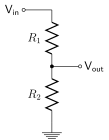

# day 1

## overview

- introduction to microcontrollers

- sensing

- measure solar panel output limits

- matching sensor range to measurement range

- introduction to arduino

- measure solar panel output with arduino

## introduction to microcontrollers

arduino is: 

- microcontroller

- interfaces
  
  - ADC (analog to digital converter)
  
  - DAC (digital to analog converter)
  
  - digital

- cheap (\$1--\$50)

- not good for space

A microcontroller is like a brain. 

sense--compute--act

## sensing

what do we sense with a microcontroller?

- anything

- just voltage

bus/payload

| bus                  | payload          |
| -------------------- | ---------------- |
| fuel level           | pixel brightness |
| battery charge state | wavelength       |
| attitude             | radio signals    |

...voltage

what range of possible voltages do we need to measure?

## solar cell output measurements

Now we will measure output of our spacecraft solar cells. 

What is maximum possible voltage? What is maximum possible current?

See diagrams in lab_00_metrology instructions--you will need to wire solar array in series and in parallel. 

Use multimeter to measure maximum possible current/voltage in series and in parallel. 

|          | voltage | current |
| -------- | ------- | ------- |
| series   |         |         |
| parallel |         |         |

## arduino measurement capabilities

Measurement

    0--30 V

Arduino MKR Zero measurement capability

    0--3.3 V

How do we turn 30V into 3V?

| actual | measured |
| ------ | -------- |
| 30     | 3        |
| 15     | 1.5      |
| 0      | 0        |

What algorithm?

    divide by 10

### voltage divider

$$
V_{out} = \frac{R_2}{R_1+R_2}V_{in}
$$

## arduino measurement lab

run through lab_00_metrology

    instructions in readme.md

    arduino code in lab_00_metrology.ino

arduino program flow

component locations

how breadboard connections work

## digital electronics/quantization

- spacecraft use digital computers
- we need to turn analog measurements into digital signals

### analog to digital conversion (ADC)

- Analog signals must be converted into digital signals on-board the S/C
- sample rates must be ≥ 2 times max frequency contained in signal (Nyquist criteria) 

$$
f_s \geq 2.2 f_m
$$

- Use an analog-to-digital converter. In the metrology lab we used Arduino’s built-in ADC to measure voltage from our voltage divider. 

Equations:

$$
f_s≥2.2f_m
$$

$$
Discrete\ num=A_{min}+(A_{max}-A_{min} ) \left(\frac{Digital\ num}{2^n} + \frac{1}{2^{n+1}} \right)
$$

$$
Quantization\ Step=\frac{A_{max}-A_{min}}{2^n}
$$

$$
Error_{max}=\frac{A_{max}-A_{min}}{2^{n+1}}
$$

A is any analog signal

- voltage
- current
- pressure
- audio wave (CD audio is 44.1 kHz)
- brightness

1 bit: 2 levels (B/W)

2 bit: 4 levels

3 bit: 8 levels

line: $ y=mx+b$

- in analog world we can define a point on the line to arbitrary precision
- in digital world we have to decide how many bits to use to represent a point
  - 1 bit: on/off
  - 2 bits: 4 possible values
  - …
  - n bits: $2^n$ possible values
- (nearly) always wrong—but (usually) close enough
  - this is engineering!
- limits:
  - bandwidth
  - storage
  - sensor resolution—match sensor range to expected measurement range
  - Physics of signal—avoid storing more data than the analog signal contains. Example: recording hi-res audio of an 8-track player. 

**Example**

|              |                | **Option #1**   |                | Option #2       |                |
|:------------:|:--------------:|:---------------:|:--------------:|:---------------:| -------------- |
| Analog Range | Digital  Value | Discrete  Value | Maximum  Error | Discrete  Value | Maximum  Error |
| 0-4 V        | 00             | 0  V            | 4  V           | 2  V            | 2  V           |
| 4-8 V        | 01             | 5.3  V          | 2.7  V         | 6  V            | 2  V           |
| 8-12 V       | 10             | 10.7  V         | 2.7 V          | 10  V           | 2  V           |
| 12-16 V      | 11             | 16  V           | 4  V           | 14  V           | 2  V           |
