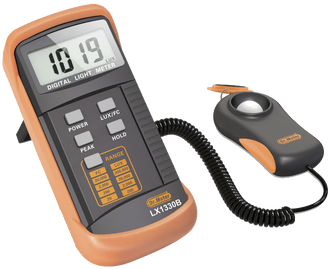
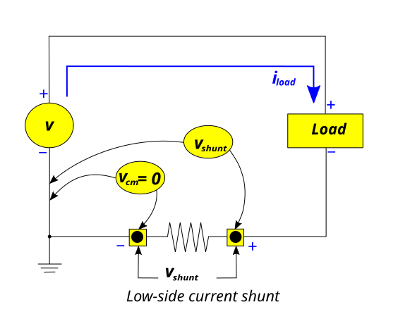
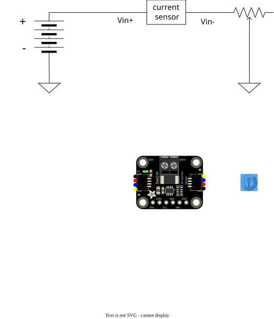

# Lab 1: electrical power

Photovoltaic solar cells have a characteristic current-voltage curve (IV curve) with a specific point that produces the maximum possible power for a given light input. 

In this lab you will test FlatSAT's solar panel to characterize its IV curve and determine if it will generate enough power to satisfy mission requirements. You will measure the voltage and current generated by the solar array at various voltages to generate an I-V plot. You will collect two sets of I-V measurements, one for a series-connected array and one for a parallel-connected array. 

You will repeat these measurements several times with different equipment setups. 

You will also record solar illuminance with a luxmeter at the time of your power measurements. 

In your post-lab analysis, you will compare your prelab performance predictions to the results you record in this lab. You will present your I-V plot and use it to identify your array's peak power. You will calculate array efficiency using the incident luminosity and the peak power generated. Finally, you will recommend any design changes necessary to ensure the solar array can meet mission requirements.

# Prelab activities

Predict solar panel performance (max power) based on the specifications provided in the prelab report instructions https://www.overleaf.com/read/fmsknsscphdd. Sketch expected IV curves for
- single cell
- 4 parallel cells
- 4 series cells

Measure your solar panel's output (short-circuit current and open-circuit voltage) with 4 cells in series and in parallel. 

|          | voltage (V) | current (mA) |
| -------- | ----------- | ------------ |
| series   |             |              |
| parallel |             |              |

## hardware

- FlatSAT
  - existing components
  - micro SD card
  - solar array
  - INA219 current sensor
  - potentiometer

## equipment

- sun
- laptop
- Micro USB cable
- USB micro SD card reader
- wires
- QWIIC cable
- luxmeter
  

## software

- Arduino IDE
- [lab_01_electrical_power](lab_01_electrical_power.ino)
- Arduino libraries (install using Arduino library manager)
  - `Adafruit INA219`

## multimeter measurement
Connect your solar cells in series using the 8-pin block at the top of the panel. 
``` text 
V+ -- O O O O
       / / / 
      O O O O -- GND
```

Place your solar panel in direct sunlight pointing towards the sun. With a multimeter measure the voltage produced by the panel and then the current. These measurements are the open-circuit voltage ($V_{oc}$) and short-circuit current ($I_{sc}$). Record these measurements. 

| $V_{oc}$ (V) | $I_{sc}$ (mA) |
| ------------ | ------------- |
|              |               |

Use 2 multimeters to measure current and voltage simultaneously. Calculate the panel's power output with the equation $P = IV$. 

``` text
V+ ------- voltmeter ------- GND
    |                   |
     ----- ammeter -----
```

| $V$ (V) | $I$ (mA) | P (mW) |
| ------- | -------- | ------ |
|         |          |        |

An ideal voltmeter has infinite resistance. An ideal ammeter has zero resistance. When they are connected in parallel the ammeter shorts the circuit, creating zero voltage and therefore zero power. 


Use a potentiometer as a variable resistor to simulate the spacecraft's electrical load. Record voltage/current measurement pairs as you slowly turn the potentiometer end-to-end. 

``` text
V+ ------- voltmeter ----------------------- GND
    |                                  |
     ----- ammeter ----- resistor -----
```

| $V$ (V) | $I$ (mA) | P (mW) |
| ------- | -------- | ------ |
|         |          |        |
|         |          |        |
|         |          |        |
|         |          |        |
|         |          |        |
|         |          |        |
|         |          |        |
|         |          |        |

Plot these points (by hand) to illustrate the panel's IV curve. 

## arduino measurement
Now use FlatSAT's arduino microcontroller to automate collection of current and voltage measurements. A microcontroller's electrical measurement capabilities are not as sophisticated as a multimeter's. This microcontroller has an analog-to-digital-converter (ADC) that can measure voltages from 0-3.3 V. It has no hardware to measure current. 

In order to measure the solar panel's output voltage you will use a voltage divider to reduce the output voltage (approximately 25 V) to be within the microcontroller's input range (0-3.3 V). 

> A **voltage divider** is a passive linear circuit that produces an output voltage $V_{out}$ that is a fraction of its input voltage $V_{in}$. **Voltage division** is the result of distributing the input voltage among the components of the divider. A simple example of a voltage divider is two resistors connected in series, with the input voltage applied across the resistor pair and the output voltage emerging from the connection between them.
> -[Wikipedia](https://en.wikipedia.org/wiki/Voltage_divider)


$$
V_{out} = \frac{R_2}{R_1+R_2}V_{in}
$$


A shunt resistor allows the use of a voltmeter to measure current. A (small) known resistor is placed in series with the circuit's load, and voltage is measured across it. Current is determined using Ohm's Law. 

$$
V = IR
$$


Open `lab_01_electrical_power/lab_01a/lab_01a.ino`. Connect the solar panel and microcontroller according to the wiring diagram at the top of the file.  

(Remember to place your solar panel in direct sunlight pointing to the sun.)
Upload the code. Open the serial monitor and/or serial plotter to monitor voltage and current as you adjust the potentiometer. 

| $V$ (V) | $I$ (mA) | P (mW) |
| ------- | -------- | ------ |
|         |          |        |
|         |          |        |
|         |          |        |
|         |          |        |
|         |          |        |
|         |          |        |
|         |          |        |
|         |          |        |

The same data was also written to the SD card. You can remove the SD card and plot I vs V to see the IV curve. 

## current sensor measurement

The previous measurement setup is inflexible and imprecise. Use a current sensor IC to obtain better measurements. Arduino code is in `lab_01_electrical_power`. 

Connect components according to this schematic. Connect the the INA219 current sensor to the microcontroller with a QWIIC cable. The color-coded connections for the QWIIC cable are provided at the top of `lab_01_electrical_power`. 




**Ensure all grounds/ground rails are connected**, including a connection between the solar panel's ground and the arduino's ground. 

(Remember to place your solar panel in direct sunlight pointing to the sun.)

> [!NOTE] 
> This is your first activity recording data on your SD card. Format the SD card before you begin. 
>  - insert the card in the USB reader and connect to your computer
> - Format the card using FAT32 (this erases all data)
>   - Window Explorer -> Right click -> format -> Fat 32 -> Ok
>   - When you format the card, name it after your group
> - Insert the card into your microcontroller

Upload the code and collect data by turning the potentiometer end-to-end. Also record endpoint measurements. 
- remove the potentiometer to record $V_{oc}$
- short the potentiometer/variable resistor to record $I_{sc}$

Turn off your microcontroller (unplug it) to stop recording data. Reconfigure your solar panel to 4 cells in parallel. Turn on the microcontroller and repeat the previous steps to gather data for the parallel IV curve. 

``` text
The solar panel's 10-pin block contains 2 sets of 5 connected pins. 
               O-O-O-O-O
               O-O-O-O-O

			  
Use this block to connect the cells in parallel. 

      ___________
     / _________ \
    / / _______ \ \
   / / / _____ \ \ \
  / / / /     \ \ \ \ 
 O O O O       O-O-O-O-O (V+ out)
 O O O O       O-O-O-O-O (GND out)
  \ \ \ \_____/ / / /
   \ \ \_______/ / /
    \ \_________/ /
	 \___________/

```
## data collection scheme

FlatSAT saves current and voltage to `iv_curve.csv` every 200 ms. On each powerup it writes a legend and begins logging data. Subsequent powerups will again write a legend and add more data to the file. The legend message can be used to separate test runs. It will be obvious which run is series vs parallel. 


## data collection and analysis

Create an IV curve from `iv_curve1.csv` (your arduino measurement). 
Create an IV curve from `iv_curve.csv` (your INA219 measurement). 
Perform data analysis from `lab 1 analysis.pdf`
