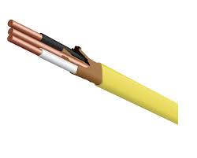
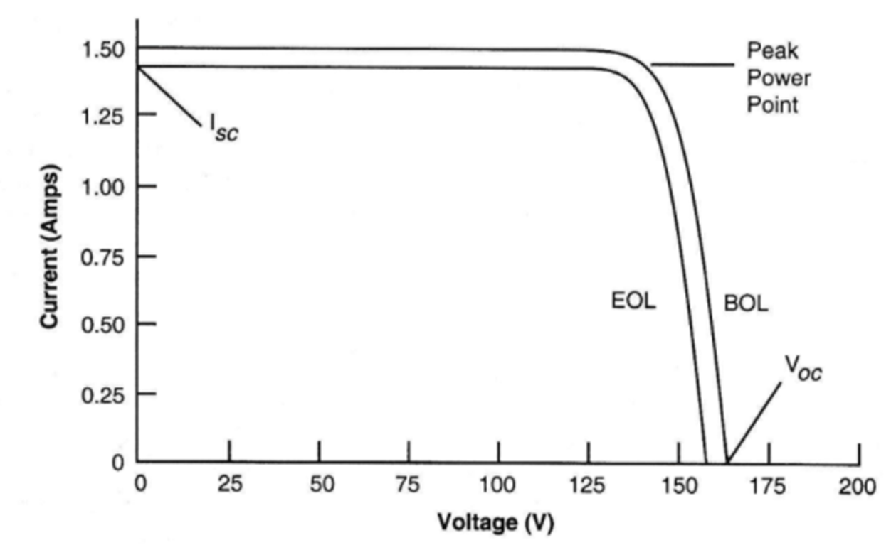
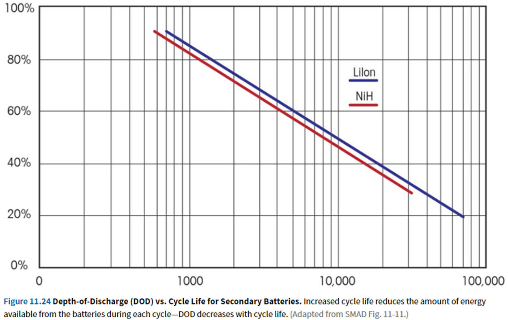
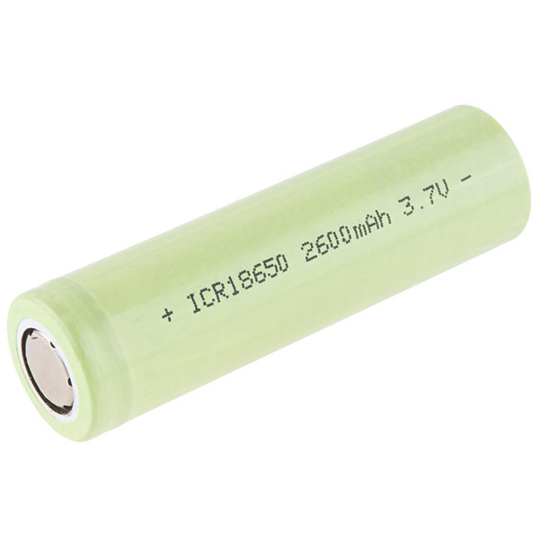

# electrical system

## admin

talk about cubesats

mention ESD bracelets

troubleshooting

### course schedule

1. space, electronics, microcontrollers
2. electricity
3. cameras
4. communication
5. attitude

- learn
- predict
- complete lab
- analyze/document

### today

- electrical lesson
- complete prelab predictions
- electrical lab
  - analyze/document

## electricity

voltage, current, power, resistance

water analogy

measurement

- ohmmeter (multimeter in ohm mode)
  - applies a very small voltage to the circuit and measures current
- voltmeter (multimeter in volt mode)
  - “infinite” resistance
  - “no” current through meter
- ammeter (multimeter in current mode)
  - “zero” resistance
  - flows through meter/transducer

difference: electricity needs a return path

We call that return path ground

*circuit*: the whole loop 

-  a circuit breaker breaks the circuit and stops the flow of electricity
-  each breaker in a building controls an entire loop
-  Each NM-B cable contains an entire loop—3(!) wires

DC/AC

frequency

power supply in Singapore

In Singapore the power plug sockets are of type G. The standard voltage is 230 V and the frequency is **50 Hz**.

https://repairs.sg/guide/electrical-wire-colour-code-singapore/

Confusion: Ground means something different in U.S. building wiring—this terminology difference is very confusing if you turn a student loose on an electrical project and expect them to learn some electrical basics 

Electronics: 
ground = electrical return path 
always carries full current of the circuit
ground can be black, white, green, blue, brown, bare—anything but red

buildings/NEC:

- ground = safety ground
  - never carries current unless something is broken
  - ground can be green or bare
- “neutral” = electrical return path
  - NEC uses the term “grounded conductor”
  - neutral is connected to ground somewhere in the building—should be zero voltage between
  - neutral is always white

Other terms:

- *load* the electrical device connected in a circuit
  - often specified as a power rating (1200 W microwave, 3 HP motor)
  - often specified as current draw (50 A car charger)
- *closed/on* a connected circuit with current flowing through it (typically flowing through a load)
- *short* a closed circuit connected through essentially no load—usually inadvertent (but today we will measure the solar array’s short-circuit current)
- *open/broken/off* a circuit with the load removed and V+ disconnected from ground/V-

AC conversion

transformers

### Ohm’s law

$$
V=IR
$$

- every electrical device has some inherent internal resistance

- If you connect it to its design voltage, it will draw its design current
- If the circuit (wiring/fuse or breaker) is undersized for this load, something will break

$$
P = IV
$$

## safety

- A load is designed for a certain supply voltage, and then its internal characteristics cause it to draw a certain amount of current.
- connecting to too-high voltage will fry the device

- Wires need to be sized adequately
- breakers protect wires
- safety ground (“ground”) protects you
  - should trip breaker
  - can still provide enough current to kill
  - GFCIs detect current leakage and break circuit fast enough to save you

**Never connect a multimeter to a voltage source!** 

(Despite the fact that I told you to do this yesterday)

- Best case: voltage source has enough internal resistance that nothing bad happens (this is why nothing bad happened yesterday)
- usual case: breaker trips or fuse blows
- bad: something else breaks or burns

## energy

Forms of energy:

- mechanical 
  - deformation
  - pressure
  - gravity
  - magnetism
- electromagnetic
- chemical
- electrical
- nuclear
- thermal

Why specifically spend time on “electrical system?”

- electricity is an easy way to move energy around

What about storage?

- “batteries” typically store energy as chemical potential energy
- capacitors can directly store electrical potential, but storage is small and leakage is high

## typical spacecraft electrical system

- energy generation: photovoltaic solar cells

- energy storage: rechargeable chemical batteries

## analysis

key questions:

- will the solar array…
  - provide enough power to run the spacecraft and charge the battery?
  - still provide enough power after degrading for the entire mission life
- will the battery…
  - store enough energy to operate the spacecraft (through eclipse)?
  - provide enough power to run the spacecraft (through eclipse)?
  - last through enough lifetime cycles to still meet those requirements at end of mission life?

### spacecraft

each orbit, needs enough power to

- run spacecraft during daylight
- charge batteries

must do that during daylight

(see presentation)

$$
P_{req} = \frac{P_{ecl}T_{ecl}+P_{sun}T_{sun}}{T_{sun}}
$$

### solar array

- efficiency
- degrades every year

equations on `lab 1 analysis.pdf` and Astro equation sheet

Pbol=S $\eta$ A Id cos$\theta$

- *P* power output
- *S* solar input: 1358 W/m^2 near Earth
  - more near Mercury, less near Pluto
  - $\eta$ efficiency: 15-33%
- *A* cell area
- $I_d$ inherent degradation from manufacturing defects, wiring, soldering, etc
- $\theta$ angle between sun and cell

Peol = Pbol(1-degradataion)^life

- degradation: 2-5%/year

best cells (2022): 
SolAero IMM (inverted multi-junction metamorphic): 33% efficiency
used on Mars helicopter

IV curve

solar cells/panels have a curve like this

### battery

$$
Cap = \frac{E_{ECL}}{DOD}
$$

Capacity: Energy (Joules)

Joule = Watt second

commonly use Watt hours

battery manufacturers use Amp hours

P = IV

depth of discharge: use less of battery’s capacity to prolong lifetime (cycle count)

Battery: array of cells

(AA is not a battery, 9V is)

de factor standard

18650-size lithium ion cell

18 mm x 650 mm

this class: NCR18650B (see datasheet)

